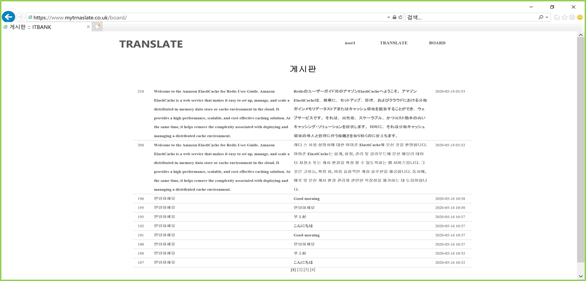
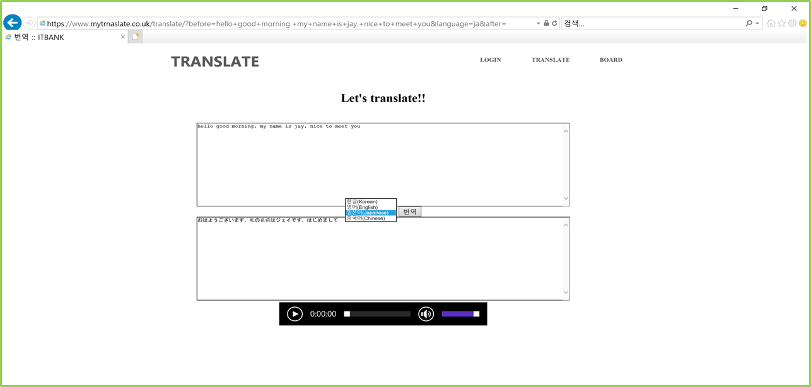
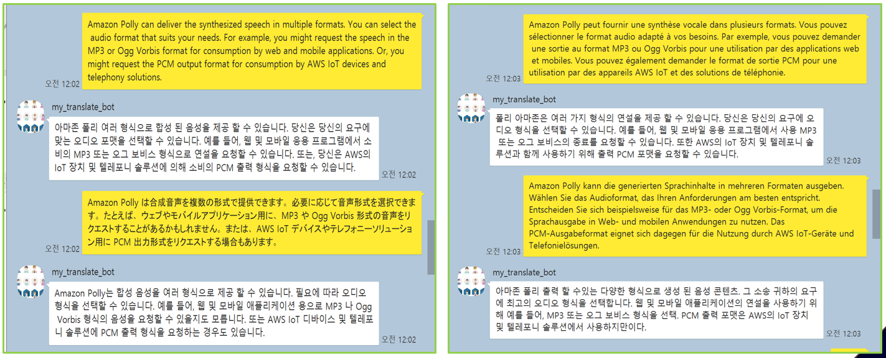

### Description

> python의 googletrans를 이용하여 간단한 번역 홈페이지를 만들어 봤다. 한국어, 영어, 중국어, 일본어 총 4개의 언어로 번역이 가능하며 음성파일 또한 제공된다. 간단하게나마 카카오i오픈빌더를 이용하여 플러스 채널도 구성하엿다.

### 개발환경

- Python
- Django
- AWS
- CentOS
- MariaDB

### 기능

- 회원과 비회원 모두 이용가능
- 회원으로 로그인시 데이터베이스에 저장된 자신의 번역 목록을 볼 수 있으며 음성파일 재생이 가능.
- 비회원으로 로그인시 비회원으로  사용한 모두의 목록을 볼 수 있으며 음성파일 재생이 가능
- 현재 카카오톡에서는 외국어 -> 한국어로의 번역만 가능하며 음성재생은 불가능.

### AWS 구성

**A.**   **VPC**

​            i.     하나의 VPC를 구성하였으며 2개의 Web Server Private Subnet / 2개의 RDS Private Subnet / 2개의 Bastion_host Public Subnet를 구성.

​           ii.     Routing Table또한 public routing table , private routing table 각각 하나씩 구성.

​           iii.     NAT Gateway 와 Internet Gateway 설정 후 인터넷 연결.

​	**B.**   **EC2**

​            i.     EC2는 Bastion_host 1개, Web server 1개, Auto Scaling Group 1개 구성

​           ii.     Auto Scaling Group 구성

​           iii.     로드밸런서 구성. 

​	**C.**   **보안그룹**

​            i.     DB Server

​           ii.     Web Server

​           iii.     Bastion Host

​           iv.     Load Balancer

​	**D.**   **Route53**

​            i.     도메인 등록후 A 레코드 생성

​           ii.     ACM 인증서 생성후 https 접속 확인

​	**E.**   **IAM**

​            i.     Aws API를 사용하기 위한 access key 및 secret key 생성

​            i.     AWS CLI를 사용하여 IAM에서 생성한 Access_key를 이용하여 AWS configure 구성

​           ii.     IAM 사용자에 대한 S3의 모든 동작 허용 버킷 정책 설정

​           iii.    Python에서 발급받은 access key 및 secret key를 등록하여 Aws polly api를 불러온다

​	**F.**   **Python**

​            i.     googletrans 모듈을 이용한 번역

​           ii.     boto3 와 발급받은 access key 를 등록하여 aws polly api를 불러온다. (문자 -> 음성파일)

​           iii.    번역한 문장을 mp3파일로 변환후 S3 버킷에 업로드후 Presigned url을 생성하여 사용자에게 전달

​           iv.    데이터 베이스 모델을 정의 후 aws RDS를 이용

### 사용한 AWS 리소스

- EC2
- IAM
- VPC
- S3
- RDS
- ACM
- Polly
- Route53
- AWS CLI

### 홈페이지 화면

- 게시판

  > 회원으로 로그인시 자신이 번역한 목록, 비회원으로 로그인시 비회원으로 이용한 사용자들의 목록을볼 수 있다.
  >
  > 

- 번역

  > 4개의 언어 번역과 발음 듣기가 가능하다.
  >
  > 

- 카카오i 오픈빌더

  > 카카오톡에서도 여러 언어에서 한국어로 번역이 가능하다.
  >
  > 

