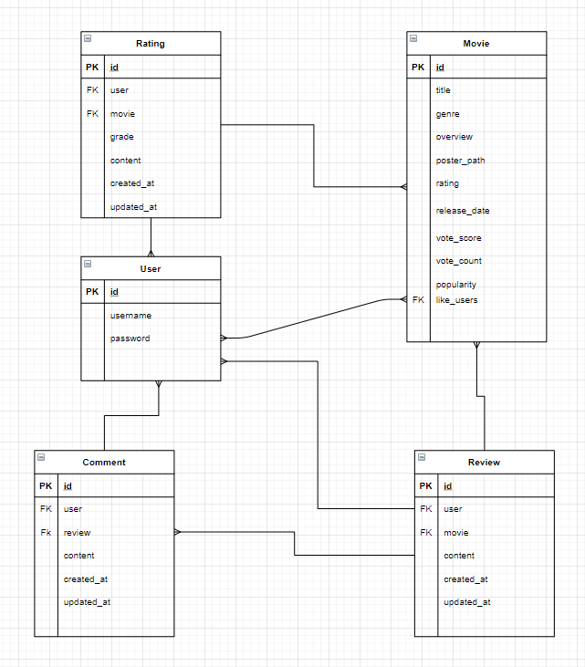
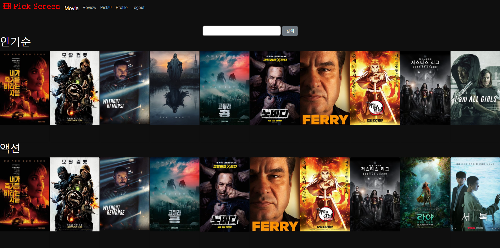
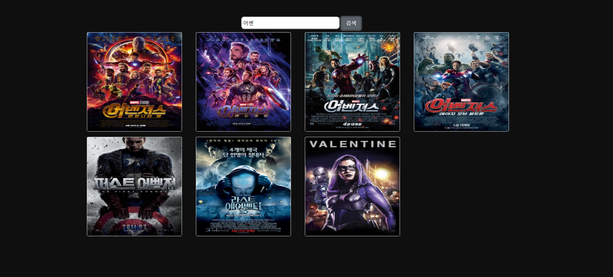
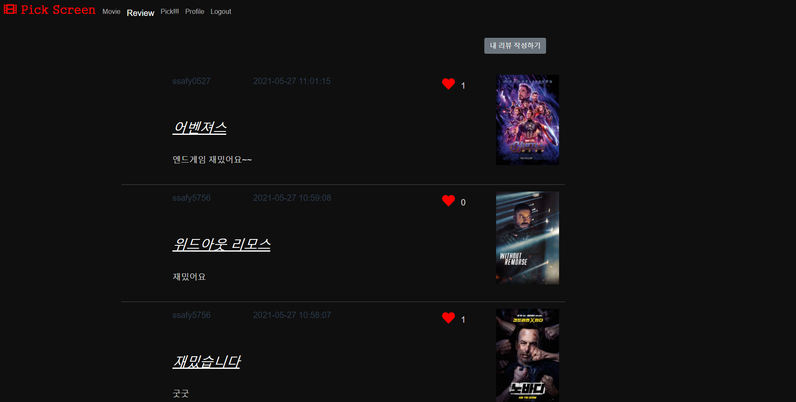
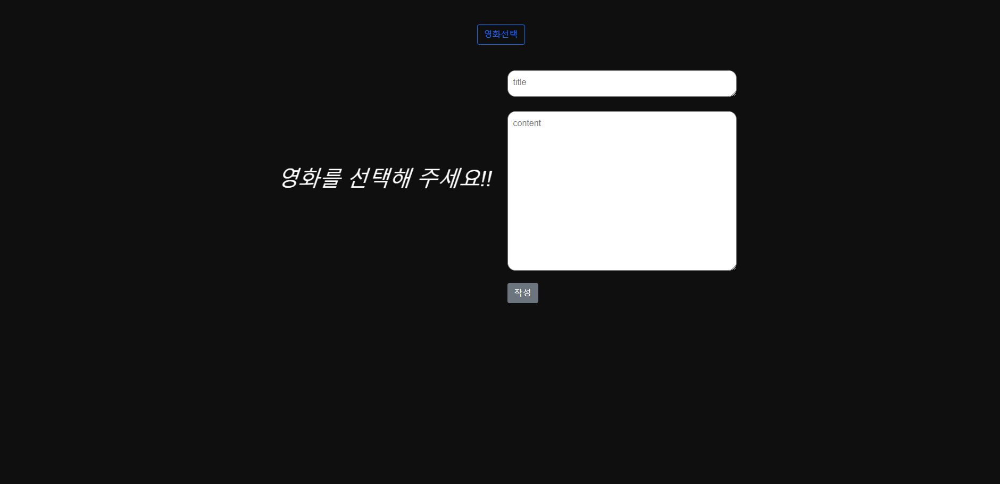
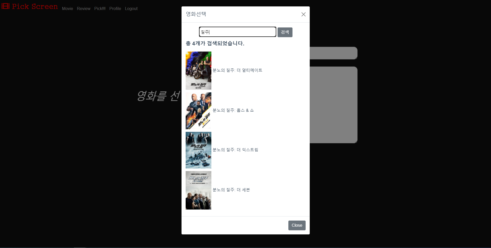
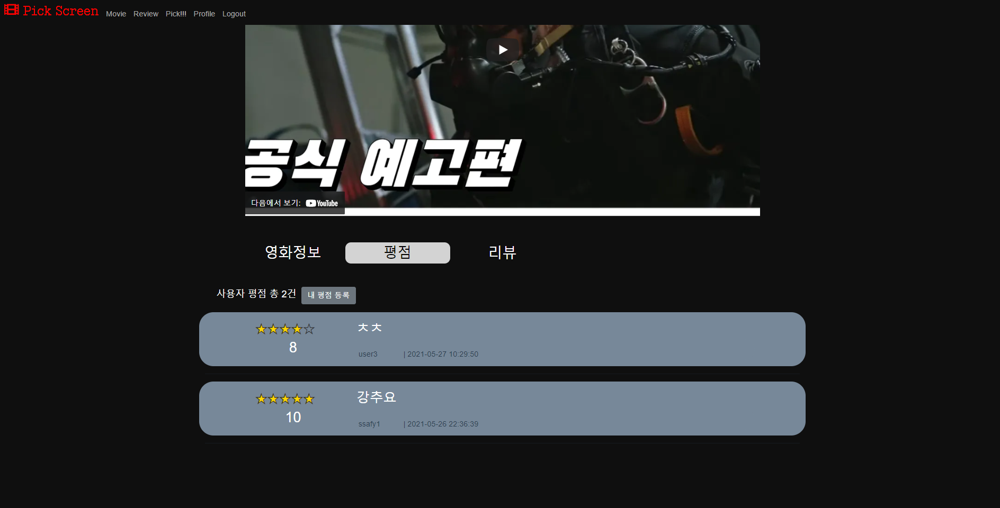
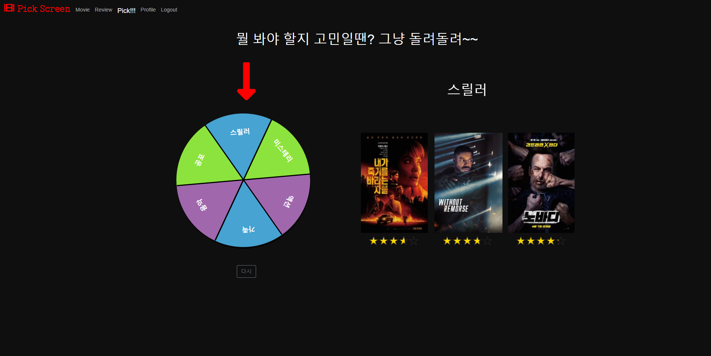

### instalation
> front 폴더안에 .env.local 파일을 만든뒤 
>
> ```
> VUE_APP_SERVER_URL={django API server IP 주소}
> 
> VUE_APP_YOUTUBE_API_KEY={YOUTUBE API KEY}
> ```
>
>  
>
> - ### Docker
>
> ```bash
> $ sudo docker build -t front .
> $ sudo docker create -p 8080:8080 --name front-1 front
> $ sudo docker start front-1
> ```
>
> 

### Description

> 사용자에게 영화 정보를 제공하며, 원하는 정보를 검색할 수 있고 리뷰, 평점, 댓글을 작성할 수 있는 영화 커뮤니티  사이트


### 개발 환경

- Python 3.8
- Django 3.2.3
- djangorestframework 3.12.4
- Vue.Js 4.5.13
- aws
- ubuntu


### 역할

- 설재홍

    `Djangorestframework` `Vue` `Vuex` `Vue Router` `CSS` `HTML` `JavaScript` `AWS` `Ubuntu` `Bootstrap`

- 황규진 

  `Vue` `Vuex` `Vue Router` `CSS` `HTML`


## ERD





## 기능

- 영화
  - 영화 추천
  - 영화 검색
  - 장르별 검색
  - 찜하기
- 리뷰
  - 작성
  - 수정
  - 삭제
  - 좋아요
  - 댓글
- 평점
  - 별점 작성
  - 평점 작성
  - 삭제
- 유저
  - 회원가입
  - 로그인
  - 프로필 페이지
- 추천
  - 룰렛을 이용한 랜덤 추천


### 홈페이지 화면

자세한 구성은 동영상 참조.

- 메인화면

> 메인화면에는 가장 인기있는 영화의 예고편이 재생된다.
>
> 
>
> ---
>
> 장르별로 영화가 표시되며 검색기능을 추가하였다.
>
> 각각의 영화목록들은 마우스 드래그로 움직일 수 있게 캐러셀로 구성하였다.
>
> 
>
> ---
>
> 검색기능
>
> 


- 리뷰화면

> 사용자들이 작성한 리뷰들의 목록이 표시된다. 좋아요 기능 추가
>
> 
>
> ---
>
> 리뷰 작성하기
>
> 
>
> 검색을 통한 리뷰할 영화 선택하기
>
> 


- 영화 상세 페이지

> 예고편을 보여주며
>
> Vue Router을 이용하여 영화정보, 평점, 리뷰 페이지 구성
>
> 
>
> 


- 영화 랜덤 추천

> 룰렛을 돌려 선택된 장르의 인기영화 3편을 보여준다.
>
> 


- 프로필 페이지

> 내가 작성한 리뷰, 평점준 영화, 찜한 영화의 목록들을 확인할 수 있다.
>
> 

## 배포 서버 url

http://54.221.95.166/

현재는 aws 무료 계정으로 인한 서버중지.

