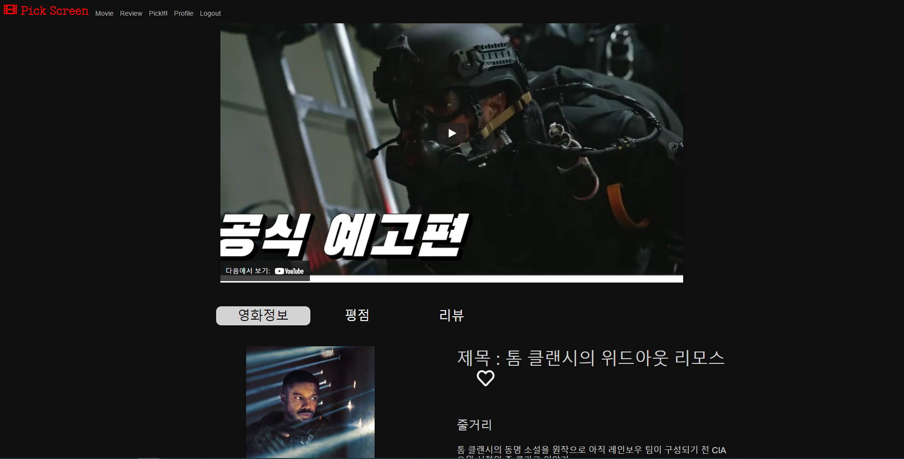

### 개발 환경

- Python 3.8
- Django 3.2.3
- djangorestframework 3.12.4
- Vue.Js 4.5.13
- aws
- ubuntu

### 역할

- 설재홍

    `Djangorestframework` `Vue` `Vuex` `Vue Router` `CSS` `HTML` `JavaScript` `AWS` `Ubuntu`

- 황규진 

  `Vue` `Vuex` `Vue Router` `CSS` `HTML`

## ERD

## 기능

- 무비리스트 

  - 인기 영화 예고편 youtube api 연동해 예고편 자동 재생
  - 장르별 영화 분류
    - 영화 클릭하면 상세페이지로
    - 장르 글자 클릭하면 해당 장르 리스트로
  - 캐러셀 기능
  - hover 기능, 제목과 별점 보여주기
  - 검색기능

- 영화 상세 페이지

  - 영화 정보
  - 별점 작성
  - 평점 작성/삭제
  - 리뷰 작성/수정/삭제
  - 찜하기 기능

- 리뷰 

  - 리뷰 작성하기
    - 영화를 선택 후 리뷰 작성 기능
  - 리뷰 상세 페이지
    - 수정하기 삭제하기
      - 작성자만 가능
    - 댓글 기능

- 프로필 

  - 리뷰, 평점, 찜 개수 보여주기
  - 리뷰, 평점, 찜 영화 리스트

- Pick 기능

  - 원판 돌리기 장르별 랜덤 영화 추천 기능

### 홈페이지 화면

- 메인화면

> 메인화면에는 가장 인기있는 영화의 예고편이 재생된다.
>
> 
>
> ---
>
> 장르별로 영화가 표시되며 검색기능을 추가하였다.
>
> 각각의 영화목록들은 마우스 드래그로 움직일 수 있게 캐러셀로 구성하였다.
>
> 
>
> ---
>
> 검색기능
>
> 

- 리뷰화면

> 사용자들이 작성한 리뷰들의 목록이 표시된다. 좋아요 기능 추가
>
> 
>
> ---
>
> 리뷰 작성하기
>
> 
>
> 검색을 통한 리뷰할 영화 선택하기
>
> 

- 영화 상세 페이지

> 예고편을 보여주며
>
> Vue Router을 이용하여 영화정보, 평점, 리뷰 페이지 구성
>
> 
>
> 

- 영화 랜덤 추천

> 룰렛을 돌려 선택된 장르의 인기영화 3편을 보여준다.
>
> 

- 프로필 페이지

> 내가 작성한 리뷰, 평점준 영화, 찜한 영화의 목록들을 확인할 수 있다.
>
> 

## 배포 서버 url

http://54.221.95.166/

현재는 aws 무료 계정으로 인한 서버중지.

## 느낀점

- 설재홍

  이번에 처음으로 front 쪽인 vue를 공부하고 직접 경험해 봤는데 이전까지만 해도 back쪽이 front보다는 훨씬 어렵다고 들어서 만만하게 생각했었습니다. 물론 django에서 많은 기능을 추가하지 않아 쉽게 느꼈을수도 있는데 생각보다 front쪽이 너무 어려웠으며 내가 생각해낸 디자인 대로 만드는게 이번 프로젝트 하면서 가장 어려웠던 부분이지 않았을까 생각합니다. 2학기가 시작되기전 복습을 좀던 탄탄하게 하여 2학기 프로젝트때 더욱더 성장한 결과물을 만들어 낼 것입니다.

- 황규진

  어려운 점이 많았지만 보람있는 FINAL PJT 였습니다. 재홍 팀장님과 실력부분이나 이해도가 차이가 많이 나서 배우는 입장에서 많이 배울 수 있는 PJT 였습니다. 아무래도 기능을 구현하는데 시간이 차이 나다 보니 기여도가 적었습니다. 하지만 많이 성장할 수 있었고 풀스택에 대한 이해와 스타일링을 하는데 노력을 들여 보람있는 마지막 일주일을 보냈습니다. 감사합니다.