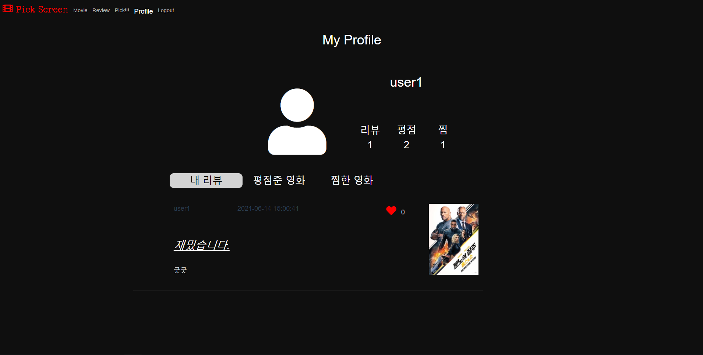

### Description

> 사용자에게 영화 정보를 제공하며, 원하는 정보를 검색할 수 있고 리뷰, 평점, 댓글을 작성할 수 있는 영화 커뮤니티  사이트


### Installation

> **Frontend**
> front 폴더안에 .env.local 파일작성
>
> ```
> VUE_APP_SERVER_URL={django API server IP 주소}
> VUE_APP_YOUTUBE_API_KEY={YOUTUBE API KEY}
> ```
> 빌드 후 dist 파일 /var/www/html/ 이동

> **Backend**
> 서버 실행후 http://{url}/movies/makeMovieData 접속해 영화 데이터 다운받기


### 개발 환경

- Python 3.8
- Django 3.2.3
- djangorestframework 3.12.4
- Vue.Js 2
- Mysql
- aws
- ubuntu
- Jenkins
- Docker


# AWS Infrastructure


# 역할

`Djangorestframework` `Rest API` `Vue` `Vuex` `Vue Router` `CSS` `HTML` `JavaScript` `AWS` `Ubuntu` `Bootstrap` `CI/CD` `Jenkins` `Docker` `Mysql`

1. Djangorestframework 를 이용한 RESTAPI server 구축
2. AWS RDS 를 이용한 mysql 데이터베이스 서버 구축
3. Vuejs 를 이용한 Frontend server 구축
4. Docker를 이용한 웹 서버 구축
5. Docker를 이용한 Jenkins 서버 구축
6. Jenkins를 이용한 CI/CD 구축
7. Mattermost, Discord와의 연동을 통해 배포 결과 메세지 전송
8. AWS load balancer 설정
9. *AWS Elastic beanstalk, Auto scailing (진행중)*


# API Documents

| URI                                                   | Method | 설명                          |
| :---------------------------------------------------- | ------ | ----------------------------- |
| accounts/                                             | POST   | 회원가입                      |
| accounts/                                             | GET    | 회원정보 리스트               |
| accounts/api-token-auth/                              | POST   | 로그인                        |
|                                                       |        |                               |
| movies/                                               | GET    | 전체 영화 데이터 가져오기     |
| movies/<<int:movie_pk>>/                              | GET    | 영화 상세정보 가져오기        |
| movies/rating/                                        | POST   | 영화에 대한 평점 작성         |
| movies/rating/                                        | DELETE | 영화에 대한 평점 삭제         |
| movies/likes/                                         | POST   | 영화 찜하기                   |
|                                                       |        |                               |
| reviews/                                              | GET    | 전체 리뷰 데이터 가져오기     |
| reviews/                                              | POST   | 리뷰 작성하기                 |
| reviews/<<int:review_pk>>/                            | GET    | 리뷰 상세정보 가져오기        |
| reviews/<<int:review_pk>>/                            | DELETE | 리뷰 삭제                     |
| reviews/<<int:review_pk>>/                            | PUT    | 리뷰 수정                     |
| reviews/comment/<<int:review_pk>>/                    | GET    | 리뷰에 대한 전체 댓글가져오기 |
| reviews/comment/<<int:review_pk>>/                    | POST   | 리뷰에 대한 댓글 작성         |
| reviews/comment/<<int:review_pk>>/<<int:comment_pk>>/ | PUT    | 리뷰에 대한 댓글 수정         |
| reviews/comment/<<int:review_pk>>/<<int:comment_pk>>/ | DELETE | 리뷰에 대한 댓글 삭제         |
| reviews/likes/<int:review_pk>/                        | POST   | 리뷰 좋아요 작성              |


## ERD


## 기능

- 영화
  - 영화 추천
  - 영화 검색
  - 장르별 검색
  - 찜하기
- 리뷰
  - 작성
  - 수정
  - 삭제
  - 좋아요
  - 댓글
- 평점
  - 별점 작성
  - 평점 작성
  - 삭제
- 유저
  - 회원가입
  - 로그인
  - 프로필 페이지
- 추천
  - 룰렛을 이용한 랜덤 추천


### 홈페이지 화면

자세한 구성은 동영상 참조.

- 메인화면

> 메인화면에는 가장 인기있는 영화의 예고편이 재생된다.
>
> 
>
> ---
>
> 장르별로 영화가 표시되며 검색기능을 추가하였다.
>
> 각각의 영화목록들은 마우스 드래그로 움직일 수 있게 캐러셀로 구성하였다.
>
> 
>
> ---
>
> 검색기능
>
> 


- 리뷰화면

> 사용자들이 작성한 리뷰들의 목록이 표시된다. 좋아요 기능 추가
>
> 
>
> ---
>
> 리뷰 작성하기
>
> 
>
> 검색을 통한 리뷰할 영화 선택하기
>
> 


- 영화 상세 페이지

> 예고편을 보여주며
>
> Vue Router을 이용하여 영화정보, 평점, 리뷰 페이지 구성
>
> 
>
> 


- 영화 랜덤 추천

> 룰렛을 돌려 선택된 장르의 인기영화 3편을 보여준다.
>
> 


- 프로필 페이지

> 내가 작성한 리뷰, 평점준 영화, 찜한 영화의 목록들을 확인할 수 있다.
>
> 


## 배포 서버 url

http://174.129.190.217


